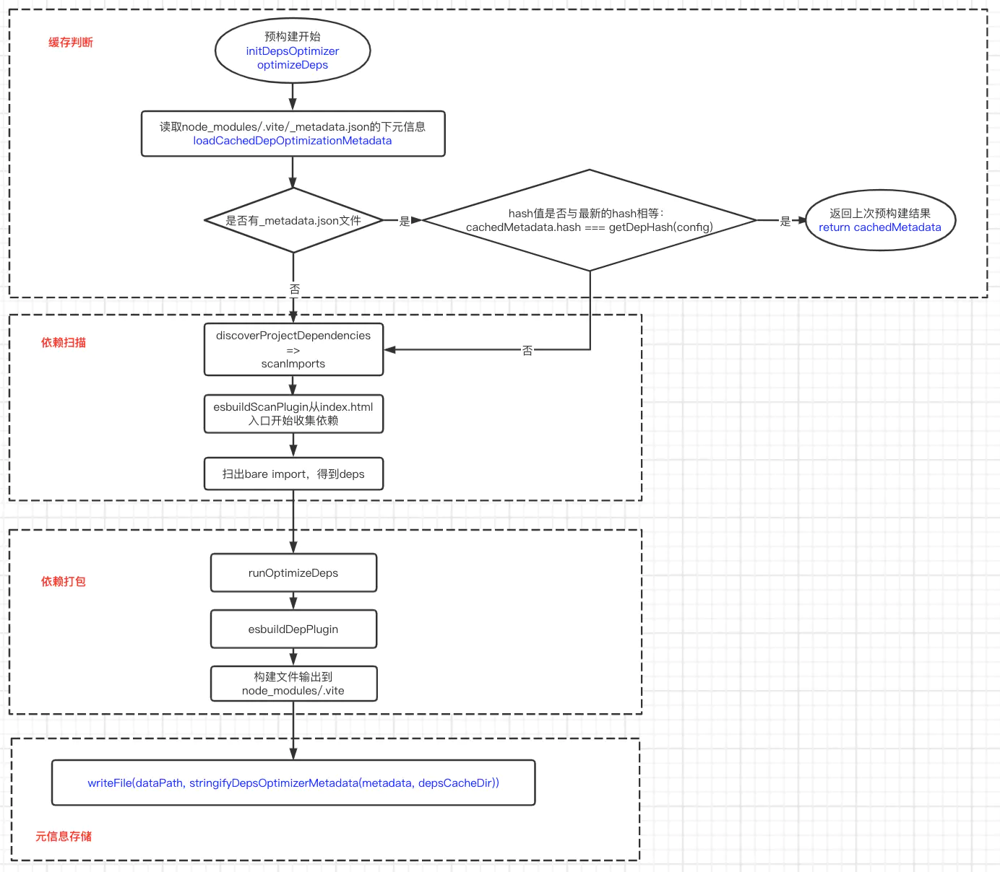

# vite

1. 请简述Vite的工作原理
2. Vite的优点是什么？
3. 请简述Vite的HMR实现原理
4. 如何实现Vite的插件开发？
5. 如何使用Vite实现多页应用？

---




```js
// vite 1.0 => vite 2.0  
本地服务器：koa => http + connect   
预优化：rollup 插件 => esbuild
```


## 工程化的痛点和解决方案
  - 模块化需求
    - 提供模块加载方案
    - 兼容不同模块规范
  - 语法转译
    - 高级语法转译 sass、ts
    - 资源加载，图片/字体等
  - 产物质量
    - 产物压缩、代码混淆、tree shaking、语法降级
  - 开发效率
    - HRM、构建提速


## 功能

- 预构建 和 依赖解析
  - 预构建：依赖统一转为 ESM 模式，由 `esbuild` 完成
  - 依赖解析：重写 url
- 模块热替换
- TS 支持
  - 天然支持 `.ts`文件，内部会进行 ts 的转译工作

## 架构

> 性能利器：Esbuild

  - 依赖于构建 - bundle 工具
    - 优点
      - 快，极致的快！
    - 缺点
      - 不支持 `ES5`, 低版本浏览器无法运行
      - 不提供操作打包产物的接口
      - 不支持自定义的 `code splitting`，降低拆包优化的灵活了 

  - 单文件编译 - ts 和 jsx 的编译工具

  - 代码压缩 - 压缩工具

  

## 核心原理

1. 模块声明

在 index.html 入口处将 main.js 的 script 标签加入 `type="module"`属性，声明是一个模块
```js
<script type="module" src="main.js"></script>
```
这样通过src或import导入的文件将会发起http请求；

vite 服务器会拦截这些请求，并将请求文件进行特别处理。


2. 裸模块替换

将裸模块替换成 node_modules 下的模块
```js
import Vue from 'vue' 会转换成 import Vue from '/@modules/vue'
```

3. 解析/@modules

接下里将/@modules解析为真正的文件地址，并返回给浏览器。

通过 import 导入的文件 webpack 会去 node_modules/包名/package.json 文件内找 module 属性,得到真正的原始模块地址。


4. 解析单文件（SFC）组件

```js
template <= /@vue/compiler-dom
script <= /@vue/compiler-sfc
style <= updateStyle
```

## 具体功能

> **模块解析**

利用 `es-module-lexer` 进行词法分析，可快速得出 `import` 和 `export` 语句

  - 裸模块导入 `vue => /@modules/vue.js`
  - 相对路径转绝对路径
    - js
    - css
  - 加时间戳，防止浏览器缓存


> **预构建**


- why?

  - 因为依赖了浏览器的 es 模块解析功能，所以必须保证所有的依赖都是 esm 规范的（但仍有许多是 cjs 的第三方模块）
  - esm 请求会造成瀑布流

- how?

  - 将其他格式(如 UMD 和 CommonJS)的产物转换为 ESM 格式，使其在浏览器通过 `<script type="module"><script>` 的方式正常加载。
  - 打包第三方库的代码，将各个第三方库分散的文件合并到一起，减少 HTTP 请求数量，避免页面加载性能劣化。

- tips
  
  - include

    在某些`动态 import`的场景下，依赖无法加入预构建，此时需要加入到`include`中强制预构建 


> **组件渲染（.vue)**


> **热替换（Hot Module Replacement）**
