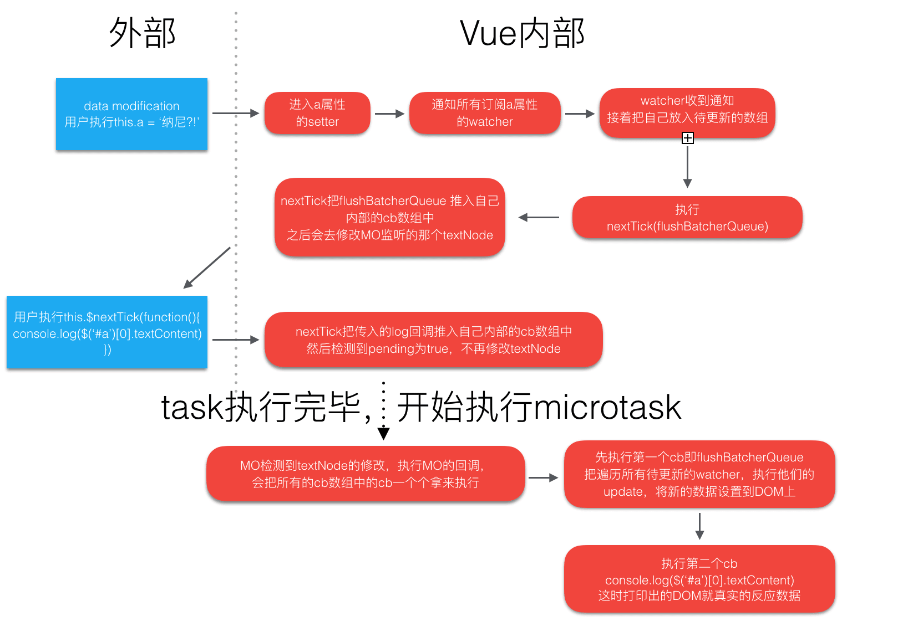
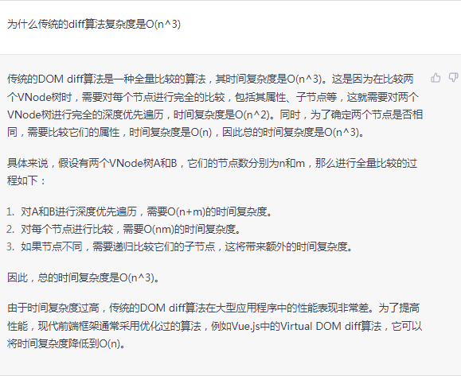
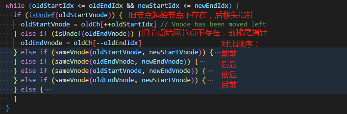
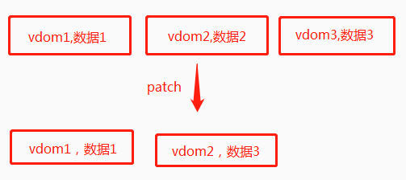

# Vue
## 一、Vue 基础
### 1. Computed 和 Watch 区别

| 区别  | watch | computed |
| :---:  | :--   | :-- |
|  用法上  | 根据响应式数据作出相应的变化 | 依赖响应式数据的变化而变化，生成了一个新的响应式数据 |
|  特点上  | 无缓存 | `有缓存`，无副作用 |
|  场景上  | 可`异步`，消耗较大 | 用于频繁变动的数据 |
|  原理上  | 相当于属性 `setter` 的回调函数 | 相当于设置了属性的 `getter` |

### 2. 组件通讯

  - 父子
    - `porps + emit`
    - $parent/$children、ref/$refs
    
  - 多层
    - `provide + inject`
    - $attrs/$listeners
    - Vue3 `defineExpose + ref`
  
  - 全局
    - `EventBus`
    - Vuex

### 3. 单页应用的理解

| 优点 | 缺点 |
| ---- | --- |
| 页面加载快，用户体验好，切换页面不用重新加载整个页面，避免不必要的重复渲染 | 首屏渲染耗时，因为首页就需要加载应用级别的 资源 |
| 对服务器压力小 | 路由管理，前进后退都需要前端实现 |
| 前后端分离，架构清晰 | SEO 难度大（顺带一提自己做过官网vue项目的seo，一个plugin，可分包，打包成多页） |

### 4. vue项目权限设计？

| 分类 | 页面权限 | 按钮权限 |
| ---- | ------- | ------- |
| 实现 | | 自定义指令 |
| | | |
| | | |


### 5. 自定义指令

**运用场景**：`权限控制` | `图片懒加载` | `按钮防抖节流`


### 6. Vue 和 React 的区别？各自的优缺点？

| 类别 | Vue | React |
| ---- | ------- | ------- |
| 模板 | sfc | jsx |
| 语法 | composition API| react hooks |
|     |     |      |

### 7. **vue 性能优化**

1. 代码优化
    + keep-alive
    + tree-shaking
    + **优化关键渲染路径**（减少重绘重排）

2. 资源加载
    + 字体图标
    + 压缩图片大小
    + 与服务端配合，利用**浏览器缓存**机制
    + 静态资源cdn
    + js和css的加载等，css放头部，js放底部
    + gzip
    + 减少网络请求

3. 页面优化
    + 图片懒加载
    + 虚拟列表
    + 路由懒加载
    + 骨架屏
    + loading动画


## 二、 生命周期
### 1. Vue2 / Vue3 生命周期？

| Vue2 | Vue3 |
| :--: | :--: |
| beforeCreated、created| setup |
| ... | ... |
| destoryed相关 | onUnmounted |

### 2. 父子组件生命周期？

> 记住一句话： `父子子父`
- 挂载，更新，销毁三个类型都是按照`父子子父`执行

### 3. created 和 mounted 的区别？哪个声明周期请求异步数据较好？

- created
- 此时数据已经加载完毕，可以更快获取服务端数据，减少页面渲染时间，提升用户体验
- SSR项目没有mount 相关的生命周期，提高统一性

###  4. keep-alive 组件的声明周期？

- deactivated
- activated


## 三、 原理题
### **1. Vue 响应式原理？？？**


> Vue 响应式的创建、更新流程

- 当一个 Vue 实例创建时，vue 会遍历 data 选项的属性，用 Object.defineProperty 为它们设置 getter/setter    
- 每个组件实例都有相应的 watcher（观察者） 程序实例，在组件渲染（`render`）的时候，会读取（touch）data 中的数据，触发 `getter`，进而让 watcher 收集依赖   
- 在修改数据的时候，会触发数据的 `setter`，进而通知（`notify`）watcher 进行数据更新，watcher触发更新函数（`trigger re-render`）重新进行渲染，生成新的虚拟 DOM 树    
- Vue 框架会遍历并对比新旧虚拟 DOM 树中每个节点的差别，并记录下来，最后将所有记录的不同点，局部修改到真实 DOM 树上。（判断新旧节点的过程在vue2和vue3也有不同）    

### 2. vue 双向绑定的理解

- what：双绑指的是 `v-model` 这个指令，用于绑定一个动态值到视图中，实质上是一个语法糖，相当于 `:value` 和 `@input/@change`
- why：可读性好，提高开发效率
- where：常用于表单中

### 3. keep-alive 组件原理

- 用 keep-alive 包裹动态组件时，可以实现组件缓存，当组件切换时不会对当前组件进行卸载。
- keep-alive 的中还运用了 LRU(最近最少使用) 算法，选择最近最久未使用的组件予以淘汰。

**实现原理**

- 在vue的生命周期中，用 keep-alive 包裹的组件在切换时不会进行销毁，而是缓存到内存中并执行 deactivated 钩子函数，命中缓存渲染后会执行 actived 钩子函数。

### 4. nextTick 原理

+ vue 中的视图更新是异步的，在数据修改后如果要获取视图，需要加到 nextTick 中
+ vue 的视图更新其实也是调用了 nextTick
  * Vue观察到数据更新，就会创建一个异步任务队列 `callbacks`，缓冲同一时间循环中发生的所有数据改变
  + 视图的更新 `flushSchedulerQueue/flushBatcherQueue`（也是一个队列，包含了许多数据更新触发要触发的watcher）会第一个入队
  + 然后是用户调用时传入的回调函数入队
  + 执行时采用`优雅降级`：`Promise` > `MutationObserver` > `setImmediate(IE)` > `setTimeout`



1. nextTick 一定可以获取到最新的视图吗？
```js
const count = ref(1)
nextTick(() => {
  console.log(document.getElementById('counter').innerHTML) // ？
})
count.value = 2
```
2. 数据改变，会触发当前的 watcher 去更新视图。多次改变时, vue会进行去重，即保证同一个 watcher 只会被加入队列一次,视图只更新一次。
3. 如果用户多次调用了 nextTick 方法，nextTick 会合并


### 5. diff 算法

[patch源码](https://blog.csdn.net/u014125106/article/details/106178805/)

1. **概念和目的：** Diff 算法是一种对比算法，通过对比新旧虚拟dom，精准快速的找出dom变化，提高更新效率。

> 个人理解
> diff算法的目的，就为了尽可能的多复用节点，减低dom操作。
> 而diff算法实质，就是在寻求 旧vdom => 新vdom 的最优解算法

2. **策略：**`同层比较`、`深度优先`、`O(n)`（其中同层比较将时间复杂度由`O(n^3)`降至`O(n)`）

    

3. **时机：** 响应式数据变化时，重新生成render函数，生成新的虚拟dom，新旧虚拟dom执行patch函数从而进行diff算法
4. **过程：**   
    - 比较新旧节点类型(tag)：不同则直接替换，相同则更新属性(props)
    - 比较新旧子节点情况(四种)
      * 都是文本节点：直接替换
      * 新有子节点旧无子节点：添加
      * 新无旧有：删除
      * 新旧都有：updateChildren `（核心diff算法）`

5. **核心 Diff 算法**

> **vue2 （双端比较）**
[diff算法在线演示](https://wanglin2.github.io/VNode_visualization_demo/)

1. 根据四种顺序对比寻找可复用节点（判断依据：`相同类型` & `相同key`） 

    

2. 对比过程中，如果找到可复用的节点，则进行 patch 打补丁操作，同时移动指针
3. 如果4种比较都找不到复用节点，则拿 `新列表的头指针节点` 在 `旧列表` 中遍历寻找 
    - 找到了：将旧列表中该节点移动至 `oldStartIndex 之前`，然后将改节点置空（便于后续跳过）
    - 找不到：创建新列表头指针节点 并插入到 `oldStartIndex 之前`

```js
  请深刻理解：**DOM节点如何移动？**、为什么是**oldStartIndex 之前**？  
```
  双端diff 其实就是在 **旧列表的基础上进行 DOM 的处理**，**处理成新列表的结构**
  - **旧列表的基础上进行 DOM 的处理**：旧列表的双指针 => 判断每个旧节点是否都处理过了（复用或删除）  
    - 旧列表任何元素与新列表 newStartIndex 节点匹配，都是在旧列表的起始元素前一个位置插入匹配元素
    - 旧列表任何元素与新列表 newEndIndex 节点匹配，都是在旧列表的结束元素后一个位置插入匹配元素
  - **处理成新列表的结构**：新列表的双指针 => 判断新列表节点是否生成完毕


> **vue3 diff（快速比较）**
    1. 自前向后
    2. 自后向前
    3. 新节点多于旧节点(新增)
    4. 少于(删除)
    5. 乱序比较 (`贪心 + 二分查找` 实现 `最长递增子序列`)

**vue3 diff 优化** 

1. 编译时  
  `patchFlags` :用于标记节点的更新类型
  `Block` :相当于普通节点加了 dynamicChildrens 属性，会收集节点本身和所有动态子节点

2. 运行时  
  `最长递增子序列`：确定不用移动的最长序列，减少diff过程中的操作次数


### 6. v-for 为什么要加key

> 帮助vue 更好的更新 virtual-dom，帮助识别更新前后是否同一个节点，防止vue 使用 `就地复用` 策略进行节点的更新

[v-for 到底为啥要加上 key?](https://juejin.cn/post/7140446835311083534)

- 就地复用 `patchUnkeyedChildren`
  - 判断依据：tag-type 和 key(不设置的时候是undefined)
- 为什么不推荐使用 index 作为 key
  - 用 index 作为 key 值带来问题的例子  
  
  v-for渲染三个输入框，用index作为key值，每个输入框填入对应key值（便于观察），删除第二项，数据上确实第二项被删除了，但发现在视图上显示被删除的实际上是最后一项！！！
  
  

### 7. 为什么要使用虚拟DOM？

  - 减少 dom 操作，减少回流重绘，保证更新的性能下限  
  - 实现跨平台，vdom是js结构，在不同平台可按照不同规则渲染

### 8. template 到 render 的过程 / 模板编译原理

  - compile 模板编译
    - 解析 parse (template => ast)  
    - 优化 optimize (patchFlag/cacheHandlers/hoistStatic)  
    - 生成 generate (ast => render)  

  - 视图更新  
    - 监听数据变化，数据变化时基于新的数据 render 生成 vnode  
    - 新旧 vode 对比，diff 生成真实 DOM  


```js
- parse
  - 以 < 开头
    - 元素开始标签
    - 元素结束标签
    - 注释
    - 文档声明 <!DOCTYPE html>
  - 不以 < 开头
    - 文本节点
    - 插值表达式 {{}}
- optimize
  - patchFlag
  - cacheHandlers
  - hoistStatic
- generate
```


## 四、 vue-router
### 1. 路由的history 和 hash 模式？区别？实现原理？

- mode：hash | history

- 区别
  - `hash` 模式带 '#'号
  - `hash` 模式url变化会刷新页面，`history` 模式不会
  - `hash` 模式下,#后面的内容不会发到服务器，服务器配置无需修改；`history` 模式需要修改服务器配置(nginx `try_files`)，否则就`404`

- 实现
  - hash
    - hashChange
  - history
    - pushState: 在历史栈中增加一条新数据
    - replaceState：替换一条数据
    - window.onpopstate: 可监听到浏览器的前进后退，history.go / back / forword 三个方法


### 2. 从0实现一个vue-router

[mini-vueRouter](../project/mini-router4.md)

[github](https://github.com/WillianLiusHao/single-routers)


## 五、 vue-x & pinia
### 1. action 和 mutation

- 先 dispatch 触发 action，action 再 commit 触发 mutation
- dispatch 异步，mutation 同步
- mutation 用于直接修数据，action可加入接口调用等

### 2. vuex 和 pinia 对比

| 类别 | 优点 | 缺点 |
| --- | ---  | --- |
|     |      |     |
|     |      |     |


## 六、vue3
### 1. vue3 对比vue2 优化

- 架构/代码优化
  - `monorepo 包管理方式`
  - `ts 支持`
  - `体积优化`
    - `移除冷门api`(filter,sync,$set,$get等)
    - `tree-shaking`: 使用了 esmodule，tree-shaking 依赖于 es6模块的静态结构特性

- 性能优化
  - `响应式`：proxy 和 Reflect 替代 defineProperty
  - `diff优化`：对比流程使用**最长递增子序列**
  - `编译优化`
      - 更新类型标记 **patchFlag**
      - 函数缓存 **cacheHandlers**
      - 静态节点提升 **hoistStatic**
      - 树结构打平 **[Block](https://cn.vuejs.org/guide/extras/rendering-mechanism.html#tree-flattening)**

- 语法API
  - `composition API`
  - `Teleport`
  - `Fragments`

### 2. vue3 响应式

1. **defineProperty 和 Proxy**

| defineProperty | Proxy |
| :--: | :--: |
| 监听对象属性 | 代理整个对象 |
| 不可监听对象增删 | 可以 |
| 需迭代遍历对象属性 | 惰性响应式 |
| 不支持map、set等数据结构 | 支持 |
| 兼容性好 | 兼容性差 |

2. **proxy 惰性响应式**
    - Vue3中使用 Proxy 并不能监听到对象内部深层次的属性变化，因此它的处理方式是在 getter 中去递归响应式，这样的好处是**真正访问到的内部属性才会变成响应式，减少性能消耗**

3. **Reflect**
    + 改正 this 指向（`receiver`）
    + proxy 的一些方法需要返回 true/false
      + 使用Object：严格模式下对对象的操作会报错导致无法返回
      + 使用Reflect：Reflect的操作会直接返回操作结果，达成 `proxy监听,Reflect执行` 的效果
    + 解决历史问题，集成了所有对Object操作的方法，且Reflect 与 Proxy 的 api 一一 对应

4. **对数组的处理 [跳转code](./%E5%93%8D%E5%BA%94%E5%BC%8F.md#%E6%95%B0%E7%BB%84%E5%93%8D%E5%BA%94%E5%BC%8F%E5%A4%84%E7%90%86)**
    + vue2改写了7种数组操作的方法
    + vue3代理数组时，也重写了一些方法

   > **why proxy 代理了还要重写？**

   - 数组的一些原生方法 `push`、`pop`、`shift`、`unshift`、`splice` 会隐式修改数组的长度，导致数组长度的副作用被重复收集，所以这些方法执行的时候需要拦截 length 的依赖收集
   - 数组的查找方法 `includes`、`indexOf`、`lastIndexOf` 对元素进行查找时，正常查找是从`代理对象查找原始数据中的某一数据`，某些情况会出现查找数据类型不同，所以需要兼容：`将数据和参数的数据类别统一化(统一为原始数据)`

5. **Set、Map的处理**
    - Vue3 对 Map、Set做了很多特殊处理，这是因为Proxy无法直接拦截 Set、Map，因为 Set、Map的方法必须得在它们自己身上调用；Proxy 返回的是代理对象  
    - 所以 Vue3 在这里的处理是，封装了 toRaw() 方法返回原对象，通过Proxy的拦截，在调用诸如 set、add方法时，在原对象身上调用方法  


### 3. Ref
  - ref内部封装一个 `RefImpl` 类，并设置 `get/set`，当通过.value调用时就会触发劫持，从而实现响应式。
  - 当接收的是对象或者数组时，内部仍然是 reactive 去实现一个响应式

**注意点**
- reactive 内使用了 ref，ref 会自动 `解包`


