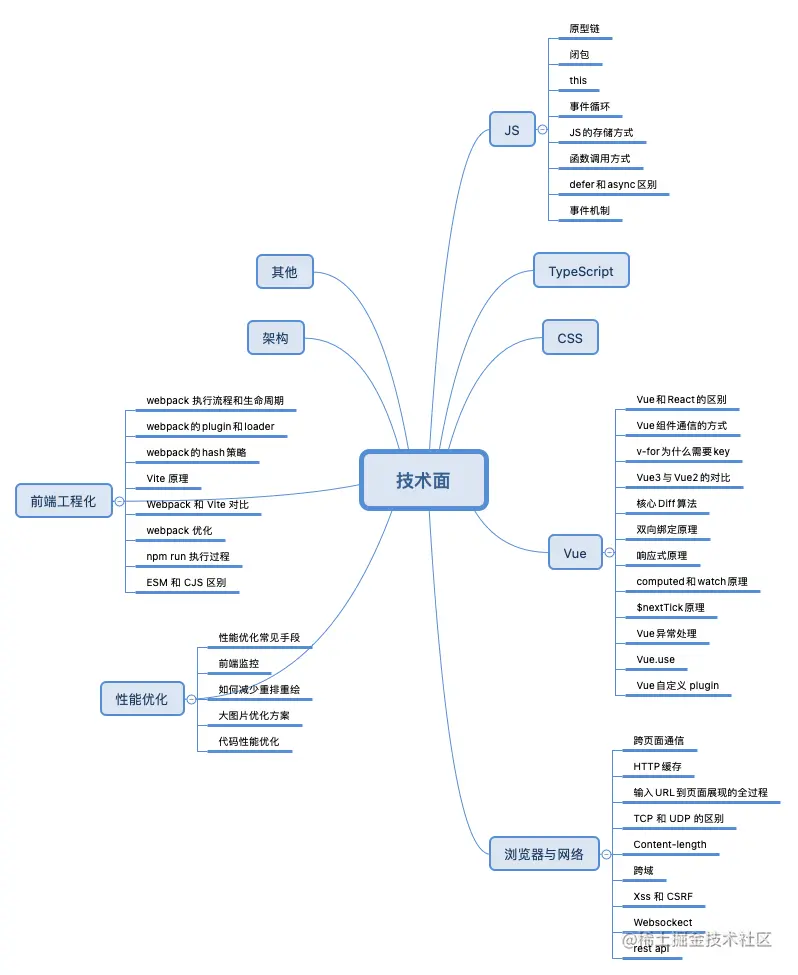

# 大纲

## 大类占比

- 基础八股文：30%
- 项目：30%
- 技术深度和原理：20%
- 算法：15%
- 技术广度：5%

### 知识点框架

1. html,css,js
2. ts
3. 框架
4. 工程化
5. 性能优化
6. 浏览器
7. 计算机网络
8. 手写题
9. 算法

### 考点梳理

> JavaScript 热门考点：

- 基本语法：语句、变量、数据类型、数组、对象、函数
- 闭包：作用域、作用、实际应用
- 原型链：原型、原型链、继承
- 作用域和作用域链：词法作用域、动态作用域、作用域链
- 高阶函数：函数作为参数和返回值、map、reduce、filter
- 异步编程：回调函数、Promise、async/await
- 事件循环：Macro task 和 Micro task、node.js 中的事件循环
- 模块化：ES6 模块化、CommonJS、AMD、UMD

> ES6 新特性：

- let 和 const：块级作用域、可以避免变量提升的问题
- 箭头函数：语法简洁、this 指向固定
- 解构赋值：数组、对象的解构赋值
- 模板字符串：多行字符串、插值表达式
- class 关键字：面向对象编程的语法糖
- Spread 操作符：数组合并、对象展开
- Import/Export：模块化的语法糖
- Promise：异步编程的解决方案
- async/await：Promise 的语法糖，使异步代码更容易阅读
- Symbol：独一无二的值

##  复习时间安排(2023.02)

### vue

> 参考资料  
> - [珠峰vue题](https://www.bilibili.com/video/BV1YM411w7Zc/?spm_id_from=333.1007.top_right_bar_window_custom_collection.content.click)  
> - [珠峰vue源码]()  
> - [村长]()  

### js

> 参考资料  
> - [「硬核js」图解Promise迷惑行为｜运行机制补充](https://juejin.cn/post/6997968693414084644)

### 网络

### 浏览器原理

1. 垃圾回收  
2. url 输入到展示
3. 浏览器事件运行机制  

> 参考资料  
> - [从输入URL开始建立前端知识体系](https://juejin.cn/post/6935232082482298911)
> - [「硬核js」你真的了解垃圾回收机制吗](https://juejin.cn/post/6981588276356317214)
> - [「硬核js」一次搞懂JS运行机制](https://juejin.cn/post/6844904050543034376)

### 项目

1. 微前端
    - **qiankun、single-spa**
    - monorepo
    - tsx
    - 复杂组件
    - 虚拟列表
    - 权限设计

2. 低代码
    - **工作原理(配置化)**
    - **性能监控**
    - 拖拽
    - 组件开发
    - git 工作流

3. 中知数通系列
    - vite
    - **jspdf**
    - puppeteer
    - echarts

    - tailwind css
    - pinia

> 参考资料
> - [腾讯三面：说说前端监控平台/监控SDK的架构设计和难点亮点？](https://juejin.cn/post/7108660942686126093)
> - [一文摸清前端监控自研实践（一）性能监控](https://juejin.cn/post/7097157902862909471)
> - [李永宁github-微前端](https://github.com/liyongning/blog/issues?q=is%3Aopen+is%3Aissue+label%3A%E5%BE%AE%E5%89%8D%E7%AB%AF)

**项目重点从以下几方面着手准备**

  - **对项目中使用到的技术的深挖**
  - **对项目整体设计思路的把控**
  - **对项目运作流程的管理**
  - **团队协作的能力**
  - **项目的优化点有哪些**

## 优秀 up 主

[菜猫子neko-阿里巴巴](https://juejin.cn/user/2885585707211437) `面题`、`前端监控`

[李永宁lyn](http://github.com/liyongning) `vue2源码` `微前端`

[CUGGZ](https://www.yuque.com/cuggz) `最全面的面题`

[谭光志](https://github.com/woai3c) `励志前端大佬` `微前端` `低代码`

[子弈-alibaba](https://juejin.cn/user/3227821870163176/posts) `阿里大佬` `很难的面题`

## 面经  

[霖呆呆的中大厂面试记录及2年前端薪资对比](https://juejin.cn/post/6844904181627781128#heading-33)

[2022凛冬之时三年经验前端面经](https://juejin.cn/post/7173316141161381924)

[「2022面经」：2年前端拿下字节阿里offer总结](https://juejin.cn/post/7173865309185671181)

[面经｜三四月前端面试问题记录](https://juejin.cn/post/7088883914005184525)

[2021字节跳动前端-掘金-cjinhuo](https://juejin.cn/post/6990174096554360869)

[前端八股文大纲](https://www.i4k.xyz/article/NumbSilver/116891971)

[我背透了这些前端八股文](https://blog.csdn.net/Y0W1as5eg37urFdS/article/details/113777492)

[做了一份前端面试复习计划，保熟～](https://juejin.cn/post/7061588533214969892)

