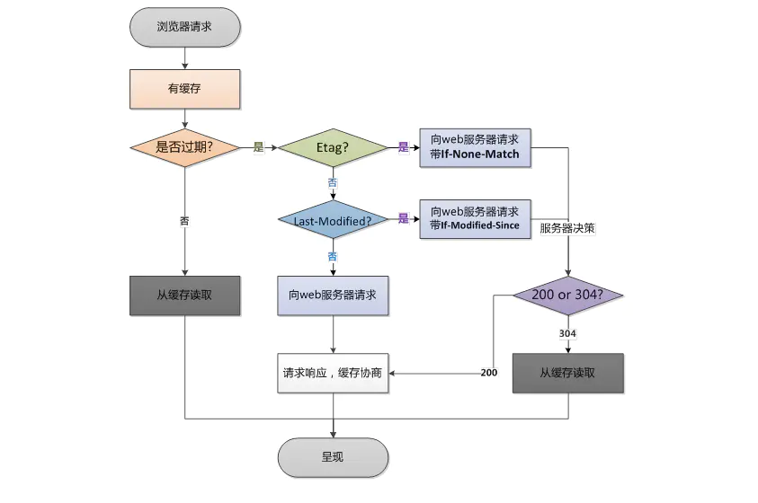

# 浏览器缓存

## 强缓存
- Expires(`HTTP/1.0`)
- Cache-Control(`HTTP/1.1`)

### Expires

代表过期时间，未超过该时间直接从缓存中取数，超过了才向服务端请求数据。

`问题`：浏览器时间和服务器时间并不一致，所以服务端返回的这个时间可能不准确。

### Cache-Control

- **max-age**: 秒为单位，指相应返回后多少秒内直接使用缓存
- no-store：不缓存
- no-cache：跳过强缓存，直接使用协商缓存
- public: 客户端和代理服务器都可以缓存
- private：只有客户端可以缓存

## 协商缓存

| 类型 | ETag | Last-Modified |
| --- | --- | --- |
| 发送 | If-None-Match: [ETag的值] |  If-Modified-Since：[Last-Modified的值]  |

- Last-modify -> If-Modified-Since
- E-Tag -> If-None-Match

> 优先级：E-Tag > Last-modify

### Last-modify

第一次请求某个URL时，服务端返回200，内容是客户端求情的资源，同时返回`Last-modify`标记该资源在服务器最后被修改的时间

客户端再次请求该URL时，会在请求头携带`If-Modified-Since`字段，用于询问服务端改请求内容是否在服务端修改了

`Last-Modified : Fri , 12 May 2006 18:53:33 GMT`
`If-Modified-Since : Fri , 12 May 2006 18:53:33 GMT`

### E-Tag

`E-Tag`是服务端为文件生成的唯一标识，浏览器二次请求的时候会携带该值带在字段`If-None-Match`上，用于询问浏览器改文件是否变化了

## 缓存位置

- Service Worker
- Memory Cache（内存缓存）
- Disk Cache（磁盘缓存，比较大的js和css）
- Push Cache（HTTP/2.0）

## 缓存的详细过程

### 
