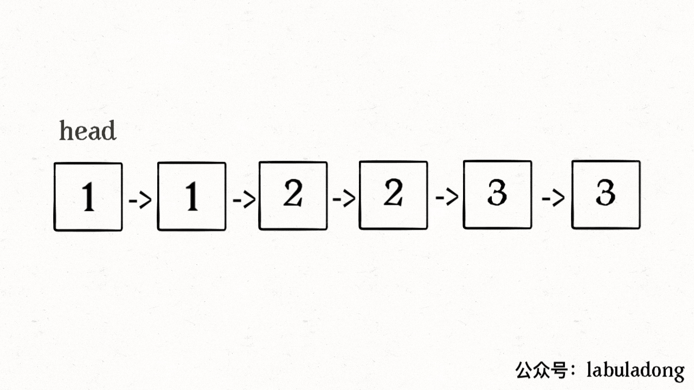

# 数组-双指针

## 分类
- 快慢指针
- 左右指针


## 1.删除有序数组中的重复项(no.26 easy)

```js
/**
 * @param {number[]} nums
 * @return {number}
 */
var removeDuplicates = function(nums) {
  let slow = 0, fast = 1
  while(fast < nums.length) {
      if(nums[fast] !== nums[slow]) {
        slow ++
        nums[slow] = nums[fast]
      }
      fast++
  }
  return slow+1
};
```

## 2. 删除排序链表中的重复元素(no.83 easy)

```js
/**
 * @param {ListNode} head
 * @return {ListNode}
 */
var deleteDuplicates = function(head) {
    if(!head || !head.next) return head
    let slow = head, fast = head.next;
    while(fast) {
        if(fast.val !== slow.val) {
            slow.next = fast
            slow = slow.next
        }
        fast = fast.next
    }
    // 最后删除slow后面的重复元素
    slow.next = null
    return head
};
```

和数组删除重复元素的区别就是，数组操作下标，但链表操作指针




## 3.移除元素(no.27 easy)

其实和第26题类似

```js

```


