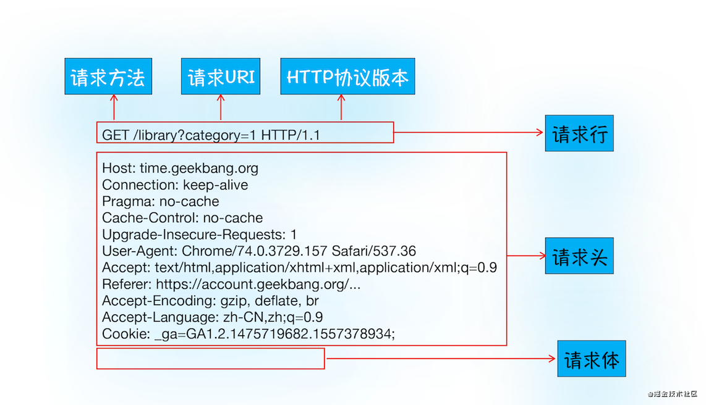
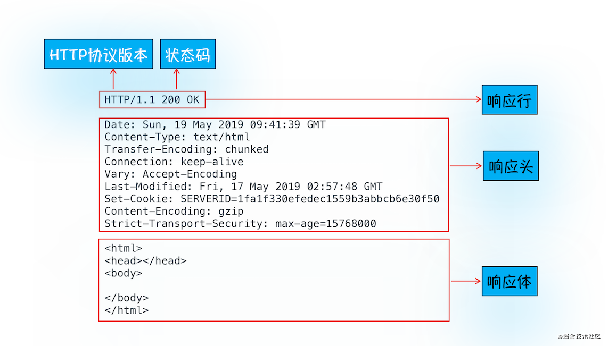

# HTTP

## 1. 概念

一句话概述 `http`

http 即 `超文本传输协议`，可分为三部分理解
  - 超文本：文字、图片、音频、视频
  - 传输：点到点之间进行数据传输
  - 协议：约定和规范

综上，「**HTTP 是一个在计算机世界里专门在两点之间传输文字、图片、音频、视频等超文本数据的约定和规范。**」

## 2. 特点和缺点

### 特点

1. 无状态
2. 简单易用：`客户端/服务器`模式 or `请求/响应` 模式
3. 灵活：`content-type` 任意类型数据传输
4. 可靠传输：基于 TCP/IP,继承了相关特性

### 缺点

1. 无状态
2. 不安全
3. 队头堵塞
4. 明文传输

## 2. http1.0、http 1.1、 http2.0

- **HTTP/1.1 相较 HTTP/1.0 的改进和优化：**  

    - **长连接**：`connection: keep-alive`
    - **管道机制**：同一个 TCP 连接，不用等待响应也可以发送多个请求，但返回需按照发送顺序返回
    - **更多缓存标识**：`Cache-Control`、`ETag`、`If-None-Match`
    - **断点续传**：206 状态码，使用请求头 `Range` 实现
    - 分块传输编码
    - 新增 Host 头处理
    - 新增更多状态码

- **HTTP/1.1 的缺点：**

    - **队头阻塞（Head-of-line blocking）**
    - 头部冗余
    - TCP 连接数限制(6个)

- **HTTP/2 的优点：**

    - **二进制分帧**：在之前的 HTTP 版本中，通过文本的方式传输数据。在 HTTP/2 中信息和数据体都是二进制，并且统称为"帧"
    - **多路复用**：在一个连接里，可以同时发送多个请求或回应，且不用按顺序一一对应，解决 `队头堵塞` 问题
    - **头部压缩**：`HPACK` 算法压缩头部后发送，且两端维护索引表，记录出现过的 `header`，后面传输就可以传输键名即可
    - **服务端推送**：服务端可主动推送与请求相关的资源

## 3. 请求和响应

### 3.2 请求报文

### 3.1 请求方法

### 3.3 响应报文

### 3.4 状态码

- `103`：服务器推送（http2）
- `200`：成功并返回数据
- `204`：成功,但不需要返回任何消息，消息体为空
- `206`：断点续传
- `301`：永久重定向。场景是域名跳转
- `302`：临时重定向。场景是未登录的用户跳转登录，浏览器默认使用 `get` 重新发出请求
- `303`：临时重定向。强制浏览器把请求方法从 `post`->`get` 
- `304`：协商缓存
- `307`：类比 `302`，区别是`307` 不改变原本的post请求，不会自动跳转
- `308`：类比 `301`，区别是`308` 不改变原本的post请求，不会自动跳转
- `400`: 请求语法错误
- `401`: 无权限，要求身份认证
- `403`: 拒绝请求
- `404`: 资源不存在
- `405`: 请求方法不允许
- `500`: 服务器错误
- `502`: 网关错误：服务器作为网关或代理出现错误
- `503`: 服务不可用：服务器目前无法使用
- `504`: 网关超时：网关或代理服务器，未及时获取请求

## 4. cookie 和 session

## 5. 安全

## 6. http 缓存

## 7. 相关问题
