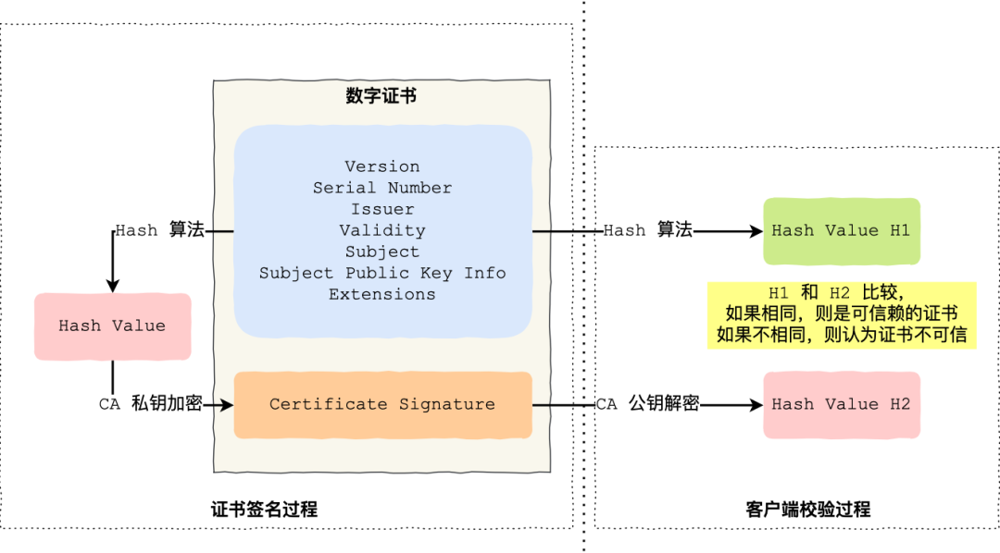
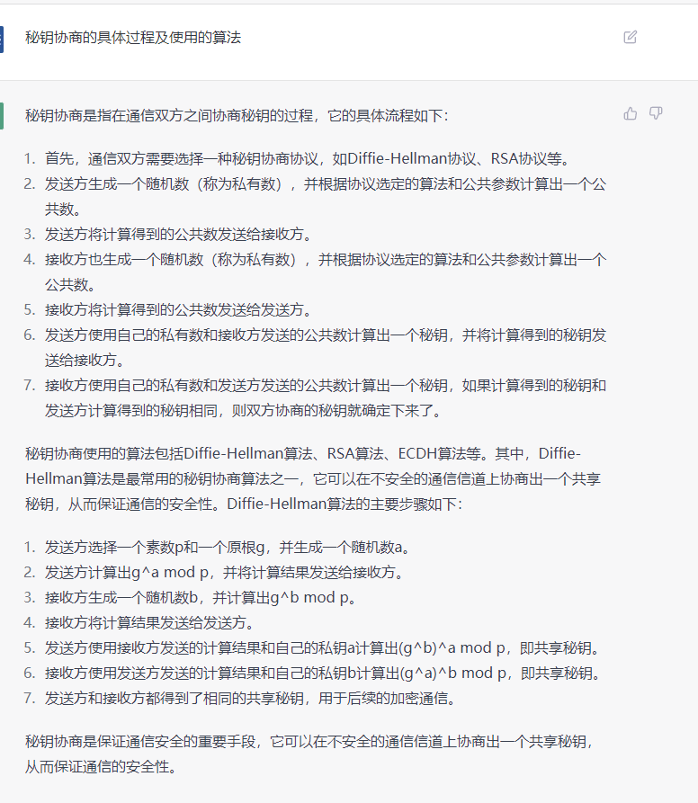
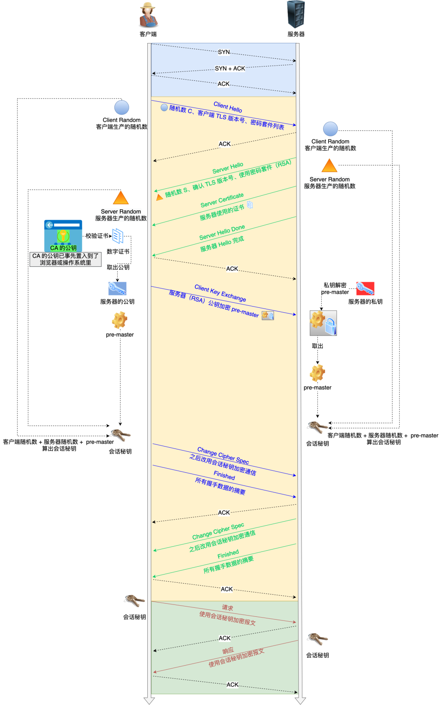
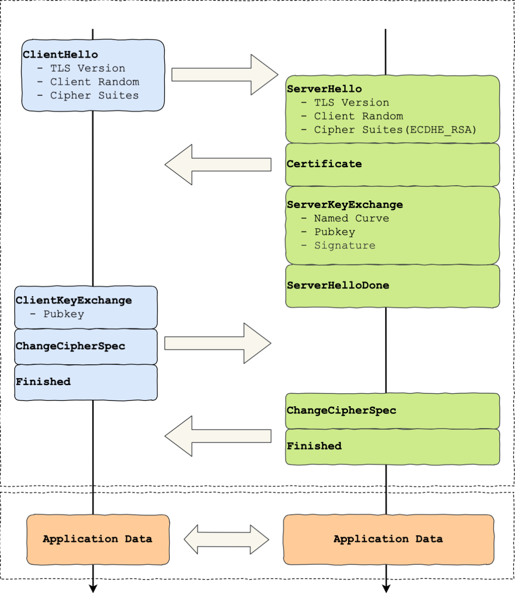
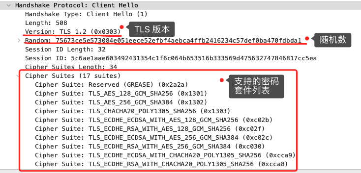
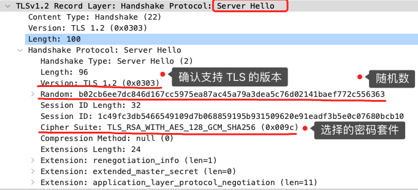
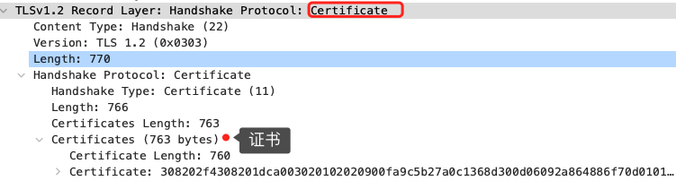
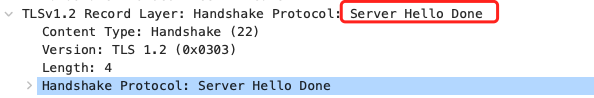
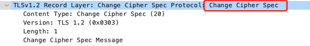
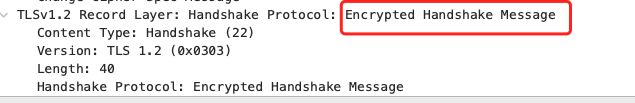

# HTTPS

## 1. HTTPS 是什么

### 1.1 概念
HTTPS 是在 HTTP 的基础上，利用 `SSL/TLS` 加密数据包。

### 1.2 SSL / TLS （王老吉和加多宝）

```js
https     =  http  +  TLS/SSL 
--------     风险      目的
  http  |   信息窃听  信息加密
--------    信息篡改  数据完整性
tls/ssl |   信息劫持  身份验证
--------     
  tcp   |
--------
```


## 2 加密

SSL/TLS 三类算法作用

- 非对称加密：身份验证，秘钥协商
- 对称加密：信息加密
- 散列算法：完整校验
 

### 2.1 对称加密 AES

**AES**
  - aes-128-ecb
  - aes-128-cbc

```js
const crypto = require('crypto')
// key：密钥   iv：盐
function encrypt(data, key, iv) {
  let cipher = crypto.createCipheric('aes-128-cbc', key, iv)
  cipher.update(data)
  return cipher.final('hex') // 输出16进制字符串
}
function decrypt(data, key, iv) {
  let cipher = crypto.createCipheric('aes-128-cbc', key, iv)
  cipher.update(data, 'hec') // 添加16进制数据
  return cipher.final('utf8') // 输出utf8字符串
}
```

### 2.2 非对称加密 RSA

**公钥加密私钥解，私钥加密公钥解**

- 非对称加密的核心：`单向函数`

- **RSA**（原始数据m, 加密数据c）
  - 公钥（e,N）已知，加密过程
    - `m ^ e % N = c`
    - 例子：5 ^ 7 % 33 = 14

  - 私钥（d,N）解密过程
    - `c ^ d % N = m`
    - 例子：14 ^ 3 % 33 = 5

> **非对称的难点在于，如何通过公钥(e, N) 算出私钥 (d, N)**，计算过程如下：
  1. **N**：已知，且为 2个质数(p,q)的乘积，即 `p * q = N` (分解一个数成2个质数乘积是数学上的难题)
  2. **欧拉积 FN**：`FN = (p-1)*(q-1)`
  3. 最后通过如下公式找到密钥的关键 **d**：`e * d % FN == 1`

### 2.3 哈希 MD5/SHA256

特点 
1. 不同输入有不同输出
2. 单向
3. 长度固定 

| hash类型 | md5 | sha256 |
| ---- | --- | ------ |
| 长度 | 32 | 64 |
| 加盐 | × | √ |

### 2.4 数字签名 SHA256 RSA

- 作用：**验证数据完整性 / 认证发送者身份**
- 基本原理：**私钥签名，公钥验证**
- 具体流程
  - 发送者用 `hash算法` 对要传递的信息进行摘要，生成 `数字指纹A`
  - 发送者使用自己的 `私钥` 对数字指纹进行加密,形成 `数字签名`
  - 发送者将 `消息`和`数字签名` 一同发送给接收者
  - 接收者使用发送者 `公钥` 进行解密，得到 `数字指纹A`（信息的hash值）
  - 接收者使用 `hash算法` 接收到的信息进行摘要，生成 `数字指纹B`
  - 接收者比对 `A和B` ，如果一致，则验证了 `数据的完整性` 及 `发送者的真实性`
- 实现

```js
const { generateKeyPairSync, createSign, createVerify } = require('crypto')

/**
 * 数字签名和验签
 */
// 生成密钥对
const rsa = generateKeyPairSync('rsa', {
  modulusLength: 1024,
  publicKeyEncoding: {
    type: 'spki',
    format: 'pem' // base64 格式
  },
  privateKeyEncoding: {
    type: 'pkcs8',
    format: 'pem',
    cipher: 'aes-256-cbc',
    passphrase: 'passphrase' // 私钥密码
  }
})

let file = 'file'
/* 文件签名*/
// 创建签名实例
const signObj = createSign('rsa-sha256')
// 放入文件内容
signObj.update(file) 
// 私钥进行签名，输出16进制（hex ）字符串
let sign = signObj.sign({key: rsa.privateKey, format: 'pem', passphrase: 'passphrase'}, 'hex') 

/* 验签 */
const verifyObj = createVerify('rsa-sha256')
verifyObj.update(file)
const isValid = verifyObj.verify(rsa.publicKey, sign, 'hex')
```

### 2.5 数字证书

- 目的
  - 认证 **公钥持有者的身份**,防止第三方冒充
- 内容
  - 公钥
  - 持有者信息
  - 证书认证机构（CA）的信息
  - 证书有效期
  - ...

**签发和验证流程**
  

  - **CA 签发证书**，如上图左边部分： 

    - 首先 CA 会把持有者的公钥、用途、颁发者、有效时间等信息打成一个包，然后对这些信息进行 Hash 计算，得到一个 Hash 值

    - 然后 CA 会使用自己的私钥将该 Hash 值加密，生成 `Certificate Signature`，也就是 CA 对证书做了签名

    - 最后将 Certificate Signature 添加在文件证书上，形成数字证书

  - 客户端 **校验服务端的数字证书** 的过程，如上图右边部分

    - 首先客户端会使用同样的 Hash 算法获取该证书的 Hash 值 H1

    - 通常浏览器和操作系统中集成了 CA 的公钥信息，浏览器收到证书后可以使用 CA 的公钥解密 Certificate Signature 内容，得到一个 Hash 值 H2

    - 最后比较 H1 和 H2，如果值相同，则为可信赖的证书，否则则认为证书不可信

**全流程及具体字段**  


### 2.6 算法

**Diffie-Hellman 算法(DH算法)**

- 特点：双方都不需要告知对方自己的秘钥情况下，协商一个公共的秘钥出来
- 使用场景：协商密钥，计算对称加密的秘钥

- 图解

  

- 算法数学原理(`离散对数`)
```JS
// 假设 p=2, a=3, b=4, N=10
// a,b 是私钥，各自保存
// 底数p，模N 是公开参数
let p=2, a=3, b=4, N=10;
let A = Math.pow(p, a) % N // 用 私钥a 生成 公钥A
let B = Math.pow(p, b) % N // 用 私钥b 生成 公钥B

let AcommonK = Math.pow(B ^ a) % N // 公钥B和私钥a计算公共密钥 commonKey = 6
let BcommonK = Math.pow(A ^ b) % N // 公钥A和私钥b计算公共密钥 commonKey = 6
```

- 代码实现
```js
// Diffie-Hellman
const { createDiffieHellman } = require('crypto')

// 客户端
const client = createDiffieHellman(512)
const clientKey = client.generateKeys() // A
const prime = client.getPrime() // 获取素数 p
const generator = client.getGenerator() // N

// 服务器
const server = createDiffieHellman(prime, generator)
const serverKey = server.generateKeys() // B

// 生成私钥
const client_secret = client.computeSecret(serverKey)
const server_secret = server.computeSecret(clientKey)

console.log(client_secret.toString('hex'), server_secret.toString('hex'))
```


**ECDHE 算法**

ECDHE 算法是在 DHE 算法的基础上利用了 `ECC 椭圆曲线`特性，可以用更少的计算量计算出公钥，以及最终的会话密钥。

小红和小明使用 ECDHE 密钥交换算法的过程：

- 双方事先确定好使用 `哪种椭圆曲线`，和曲线上的 `基点 G`，这两个参数都是公开的；
- 双方各自随机生成一个随机数作为`私钥d`，并与 `基点 G` 相乘得到`公钥Q（Q = dG）`，此时小红的公私钥为 Q1 和 d1，小明的公私钥为 Q2 和 d2；
- 双方交换各自的公钥，最后小红计算点（x1，y1） = d1Q2，小明计算点（x2，y2） = d2Q1，由于椭圆曲线上是可以满足乘法交换和结合律，所以 d1Q2 = d1d2G = d2d1G = d2Q1 ，因此双方的 x 坐标是一样的，所以它是共享密钥，也就是会话密钥。


这个过程中，双方的私钥都是随机、临时生成的，都是不公开的，即使根据公开的信息（椭圆曲线、公钥、基点 G）也是很难计算出椭圆曲线上的离散对数（私钥）。


## 3. 密钥协商

### 常见秘钥交换算法

- RSA
- **ECDHE(目前主流)**




## 4. [TLS 握手过程](https://mp.weixin.qq.com/s/U9SRLE7jZTB6lUZ6c8gTKg)

### TLS-RSA 握手(反复阅读熟记)



### TLS-ECDHE 握手  



## 5. TLS 握手过程详解

| TLS 四次握手 |           RSA           |           ECDHE           |
|    ---      |           ---           |           ---            |
|    第一次    |      Client Hello       |       Client Hello       |
|    第二次    | Server Hello<br>Server Certificate<br>Server Hello Done | Server Hello<br>Server Certificate<br>**Server Key Exchange**<br>Server Hello Done|
|    第三次    | Change Cipher Key Exchange<br>Change Cipher Spec<br>Encrypted Handshake Message（Finishd）| **Client Key Exchange**<br>Change Cipher Spec<br>Encrypted Handshake Message（Finishd） |
|    第四次    |Change Cipher Spec<br>Encrypted Handshake Message（Finishd） | Change Cipher Spec<br>Encrypted Handshake Message（Finishd）|

- 总结
  - RSA 密钥协商算法「不支持」前向保密，ECDHE 密钥协商算法「**支持**」**前向保密**；
  - 使用了 RSA 密钥协商算法，TLS 完成**四次握手后，才能进行应用数据传输**，而对于 ECDHE 算法，客户端可以不用等服务端的最后一次 TLS 握手，就可以提前发出加密的 HTTP 数据，节省了一个消息的往返时间（这个是 RFC 文档规定的，具体原因文档没有说明，所以这点我也不太明白）；
  - 使用 ECDHE， 在 TLS 第 **2 次握手中**，会出现服务器端发出的「**Server Key Exchange**」消息，而 RSA 握手过程没有该消息；


以下以 RSA 握手过程进行详细解读

### 1. 第一次握手 【**Client Hello**】

  

  客户端打招呼，主要发送了 `TLS 版本号`、`支持的加密套件列表`、`客户端随机数（Client Random）`，该随机数最后会被服务端保留，这是 `生成对称加密秘钥` 的材料之一

### 2. 第二次握手 【**Server Hello + Server Certificate + Server Hello Done**】

- **Server Hello**  

  当服务端收到客户端的【Client Hello】消息后，会确认(ACK) TLS 版本号是否支持，和从密码套件列表中选择一个密码套件，以及生成随机数 `Server Random`

  接着，返回【**Server Hello**】消息，消息里面有服务器确认的 `TLS 版本号`，也给出了`随机数（Server Random）`，然后从客户端的密码套件列表选择了一个`合适的密码套件`

  

  可以看到，服务端选择的密码套件是 
  ```js 
  “Cipher Suite: TLS_RSA_WITH_AES_128_GCM_SHA256”
  ```

  套件基本格式：**「密钥交换算法 + 签名算法 + 对称加密算法 + 摘要算法」**

  上述套件的意思是
  - 由于 WITH 单词只有一个 RSA，则说明握手时密钥交换算法和签名算法都是使用 RSA
  - 握手后的通信使用 AES 对称算法，密钥长度 128 位，分组模式是 GCM
  - 摘要算法 SHA256 用于消息认证和产生随机数；

- **Server Certificate**
  
  服务端为验证自己身份，发送 `Server Certificate` 消息给客户端，信息内包含证书

  

- **Server Hello Done**

  服务端告诉客户端，消息传递完毕，本次招呼完毕

  

> 二次握手中有几个关键事项，这里就不展开细讲了  
> 1. 客户端证书验证（见[2.5 数字证书](#_2-5-数字证书)）
> 2. 证书链


### 3. 第三次握手

- **Change Cipher Key Exchange**

  客户端验证完证书，可信则继续往下走。客户端生成新的 `随机数(pre-master)`,用服务器的 RSA 公钥进行加密，通过 **Change Cipher Key Exchange** 消息传给服务端
  
  
  
  服务端用 RSA 私钥解密，也得到了 pre-master

  至此，双方共享了3个随机数：
    - Client Random
    - Server Random
    - pre-master

  双方基于3个随机数，生成会话秘钥 **Master Secter（对称秘钥）**，用于后续的加密通讯

- **Change Cipher Spec**

  客户端通过 **Change Cipher Spec** 消息告诉服务端接下来开始切换加密协议，之后都使用对称加密进行发消息

  

- **Encrypted Handshake Message（Finishd）**

  然后，客户端再发一个 **Encrypted Handshake Message（Finishd）** 消息，把之前所有发送的数据进行摘要，再用 `maste secret` 对称秘钥进行加密，让服务端做验证，验证加密通信是否可用及 TLS 握手信息是否被 篡改过

  

### 4. 第四次握手

  也是进行 **Change Cipher Spec** 和 **Encrypted Handshake Message（Finishd）**，如果双方都验证加解密没问题，则握手正式完成
