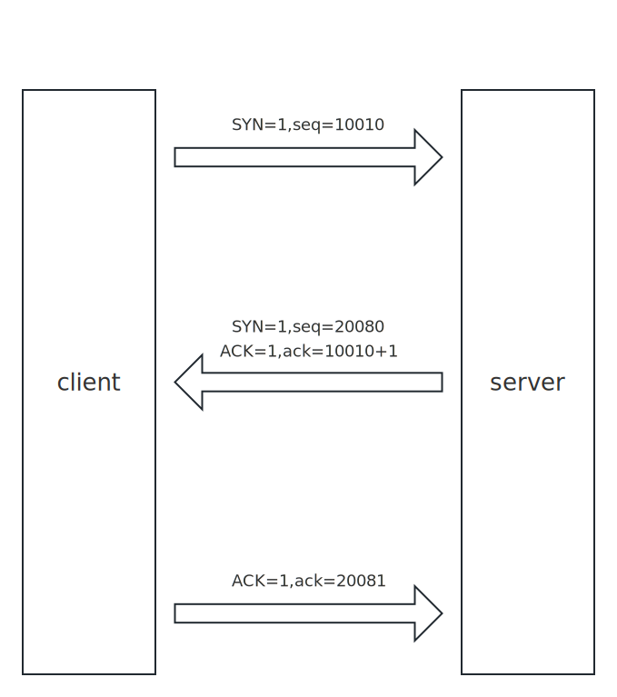
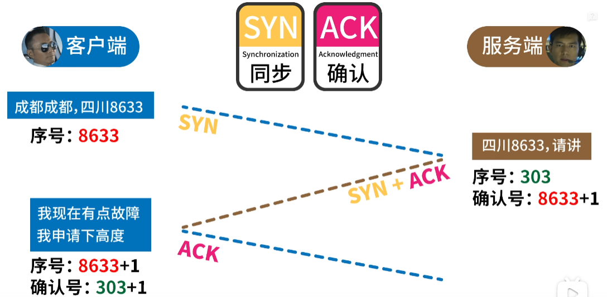
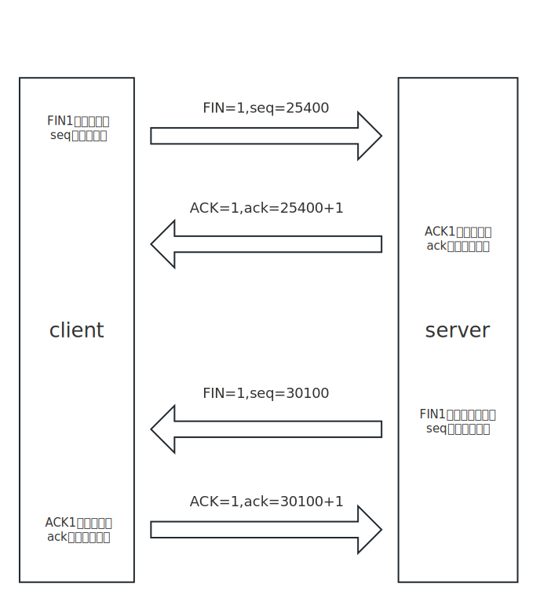
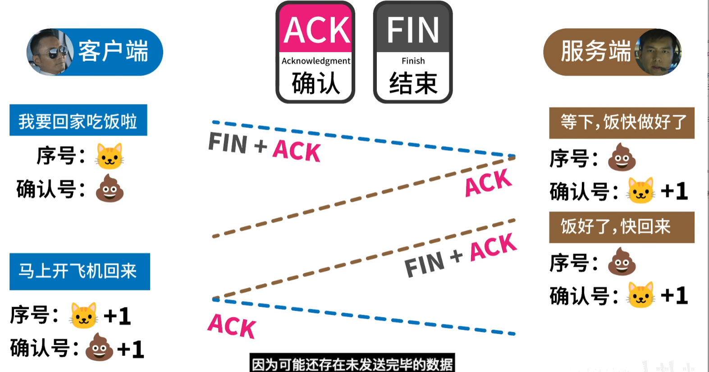

# TCP & UDP

## UDP

|   tcp   |   udp   |
|   ---   |   ---   |
| 面向连接 | 无连接  |
| 安全可靠 | 不可靠  |
| 延迟高，传输较慢 | 延迟低 |
| 大文件 | 小文件 |

## TCP

### 端口号

### 三次握手

- 目的：**建立可靠的通信通道**，确认双方的发送和接收能力

- 过程：

  - 男：喂，听得到吗？  
  - 女：听得到，你听得到吗？  
  - 男：我也听得到  
  --> 建立连接

- 图解
  - `seq` 和 `ack` 都是32字节的序号  
  - `SYN`/`ACK`/`FIN` 标志位，都是单字节（0或1）

### 四次挥手

- 过程

  - 男：我没什么要说的了，你还有的话你继续说  
  - 女：我知道了  
  男方继续听女方balabala  
  - 女：我说完了  
  - 男：我知道了  
  --> 电话挂断

- 图解

