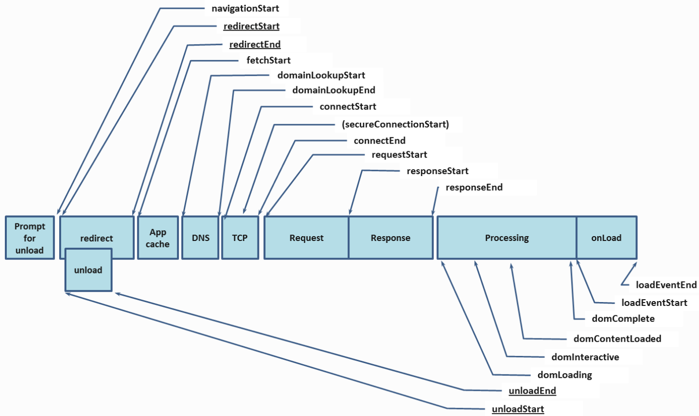

# 监控js-sdk

核心指标：`PV`、`JS错误`、`资源错误`、`网络请求错误`、`页面加载速度`

## 一、采集数据
### 1. **错误数据**

`页面地址`、`ip地址`、`发生时间`、`错误次数`、`设备信息(navigator.userAgent)`、`错误uid`，这些数据是每个错误类型都会上报的，**其中每一类错误次数是后端根据错误uid统计**

  - JS 脚本执行错误
      - **错误堆栈信息**
      - 报错信息
      - 错误类型
  - 资源请求错误
      - 资源地址
      - 类型：img / link
  - 接口请求错误
      - 接口地址
### 2. **性能数据**
  - 加载类
    - 白屏时间
    - 首屏渲染时间
    - 加载时间
    - DNS查询耗时
    - TCP连接耗时
    - TTFB请求响应耗时
  - 网页卡顿
    - FPS

### 3. **用户行为数据**
  - PV、UV、IP
  - 均停留时长
  - 链接来源
  - 自定义的埋点事件
  - 行为回溯
  - **热力图**

  *- 注册量（结合了IC注册数据）*  
  *- 转化率、跳出率（结合IC注册数据）*

## 二、数据上报

### 1. 错误监控

上报方式：`sendBeacon 直接上报`

- **JS 执行错误**
    - 通过 `window.onerror` 捕捉

    > tips： js错误在PC需要做兼容
    > - 不同浏览器内核的错误抛出方式不同
    > - 不同浏览器内核同个 API 返回的字段也可能不同

- **资源请求错误**

  通过 `addEventListener('error', callback, true)` 在捕获阶段捕捉资源加载失败错误。

- **接口请求错误**

  改写浏览器内置的 `XMLHttpRequest` 和 `fetch`

### 2. 性能监控

客观数据直接上报：`白屏` `首屏` `加载时间` `DNS/TCP/TTFB`  
需计算再上报：`FPS`

主要用到的都是性能指标 `Performance API`，符合 W3C 标准

- **白屏时间**
    - **方案1：性能指标的 FP**  
    - 方案2：`performance.timing.domLoading - performance.timing.navigationStart`

- **首屏时间 <= 2.5s**
    - **方案1：直接使用 LCP**  
    - 方案2：通过 MutationObserver 进行手动计算

    计算过程：

    1. 利用 MutationObserver 监听 document 对象，每当 DOM 元素属性发生变更时，触发事件。
    2. 判断该 DOM 元素是否在首屏内，如果在，则在 requestAnimationFrame() 回调函数中调用 performance.now() 获取当前时间，作为它的绘制时间。
    3. 将最后一个 DOM 元素的绘制时间和首屏中所有加载的图片时间作对比，将最大值作为首屏渲染时间。

- **加载时间**
    - `timing.loadEventEnd - timing.navigationStart`

- **DNS/TCP/TTFB**
    - DNS：`domainLookupEnd - domainLookupStart`
    - TCP：`connectEnd - connectStart`
    - TTFB：`responseStart - requestStart`

- **页面卡顿(FPS)**
    - 利用 `requestAnimationFrame()` 可以计算当前页面的 FPS。

    计算逻辑：开始前先记录一个初始时间，然后每次触发 requestAnimationFrame() 时，就将帧数加 1。过去一秒后用 `帧数/流逝的时间` 就能得到当前帧率。

---
- [相关文章1](https://juejin.cn/post/7035647196510814221)  
- [前端性能和错误监控](https://github.com/woai3c/Front-end-articles/blob/master/monitor.md)
- [woai3c](https://github.com/woai3c/Front-end-articles/issues/26)
---

### 3. 行为监控

直接上报：`PV/UV/IP`  
阶段上报+关闭页面上报：`用户交互事件`、`停留时长`

- **PV/UV/IP**
    - pv：加载一次 sdk 算一次
    - uv：生成用户的 uuid，存在 `session`，每次加载判断 `session` 有效性
    - ip 是`后端`通过用户 `ip` 做唯一标识

- **停留时长**：页面`load`时记录时间A，`onBeforeunload`记录时间B，停留时长 = B - A

- **链接来源**：`document.referrer`

- **自定义的埋点事件**

    并非用户的所有时间都会进行收集上报，只有`埋了点的位置` 或 `手动触发了上报事件`，才会捕获并上报事件

    通过归类一套`按组件来分层级`的树状事件代码，进行埋点

- **热力图**
    服务端通过点击事件统计生成热区

- **行为回溯**
    `rrweb` 记性录屏，数据通过 websocket 上报，缺点是数据量太大了

## 三、项目总结

对标产品：友盟，百度统计

### 背景

- `错误监控`：之前的营销页面，线上出错无法及时知道，更多时候是人为的方式站岗放哨，导致生产报错，白白花了投放经费

- `性能监控`：对页面的性能好坏没有定量评价，都是人为测试凭感觉定性

- `埋点/行为回溯/录屏 rrweb`：对用户的具体行为无感知，不知道具体用户操作行为，浏览习惯，爱好，页面素材效果等

**功能**

- **邮件通知项目经理页面生产出错：页面js错误单位时间达到一定量，且一段时间无新的注册数据**

- **行为回溯 / 录屏**

- **大屏看板**
  - `访客 / 注册 / 健康状况 排行榜`
  - 用户城市分布
  - 公司营销数据概览，PV/UV/IP 的 今昨日对比

### 难点，亮点

#### 1. 各个浏览器JS错误捕获的兼容

各个内核浏览器的错误堆栈返回信息不一样，需做兼容和大量的测试

#### 2. 数据的上报策略（上报方式、上报时机）

- 上报方式：sendBeacon + XMLHTTPRequest 降级上报
  1. **sendBeacon（首选，异步、保证数据的可靠，不影响页面性能）**
  2. XMLHttpRequest
  3. ~~img~~

- 上报时机
  1. 采用 `requestIdleCallback/setTimeout` 延时上报（requestIdleCallback 会在浏览器空闲时调用）
  2. 在页面关闭前 `beforeunload` 回调函数里上报
  ~~3. `缓存上报`数据，达到一定数量后再上报~~

  `requestAnimationFrame` 的回调函数会在绘制之前执行，`requestIdleCallback`的在绘制之后执行

  如果某一帧渲染时间不到16ms(以60fps算)，那此时这一帧有一定的空闲时间，这段空闲事件就可以执行 `requestIdleCallback`

#### 3. 错误数据去重

- 错误上报数据去重
  1. 客户端基于错误的堆栈信息，生成错误的唯一ID，上报时去重

- 错误数据聚合 
  1. 服务端汇总整理数据的时候，通过错误唯一ID进行聚合统计

#### 4. sdk的打包封装、sdk加载方式、作用域隔离

**打包/加载方式**

- 异步 / 同步？

- cmd / cjs？

**作用域隔离：**

​ `try catch`：防止 sdk 的报错反而影响了页面的运行

#### 5. 客户端和服务端的时间校对

  在请求sdk的时候，通过返回的响应头的 `date` 字段，确定客户端和服务器端的时间差
  
---

参考：[说说前端监控平台/监控SDK的架构设计和难点亮点？](https://juejin.cn/post/7108660942686126093)

### 相关问题

**优化**

1. 如何把 sdk 做成跨平台可用的

思考方向：`分平台打包`

2. 如何把 sdk 做的更加通用化，并且在业务需要的时候可以快速拓展和定制

思考方向：`插件化`

---

参考资料：
- [一文摸清前端监控实践要点](https://juejin.cn/column/7097156230489047047)
