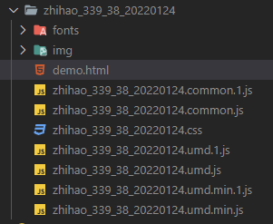
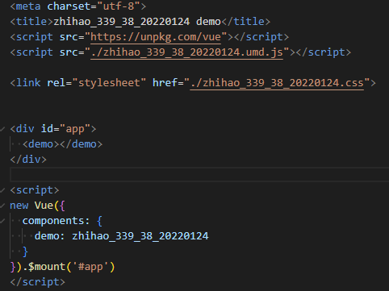

# lightning

## 1. 架构设计

### 多页应用

系统采用 `multi-page` 模式

- 其中平台及编辑页面，编辑的控制台是一个`应用A`
- 用户的模板是一个只关注活动页的`次应用B`

在 `A` 的编辑工作台中，通过 `iframe` 的方式加载 `B`

```js
// id 是活动唯一id，template 是模板的名称
<iframe
  ref="iframe"
  frameborder="0"
  :src="`/subpage/?id=${$route.params.id}&template=${$route.query.template}`"
></iframe>
```

### 工作原理

1. 进入编辑页

- 调用接口获取模板配置 `template_config`
- 合并活动配置和模板配置
  - 以 `id` 作为 `key`，


### 数据通讯

- `A` 应用的编辑工作台 读取 `setting 配置`

```js
this.activeExperiment = this.experiments[0]
```

### 渲染方式


### 作业流程

**模板发布**

开发人员，在本地通过命令发布，把本地开发好的模板及相关配置发布到线上

**活动发布**

> 线上活动读取了模板文件和配置后，合并活动配置，渲染到编辑工作台

然后在工作台可视化的点击按钮发布


## 2. 编辑器

## 3. 编辑组件、业务组件

## 4. 脚本命令

### serve

> 本地启动模板  
> yarn serve [模版名，多个空格隔开]

**1. 根据模板名生成导出文件**

`fs.writeFileSync` 生成的导出文件如下
```js
/* /src/template/index.js */
export const zhihao_339_38_20220124 = require('@/template/zhihao_339_38_20220124')
export const zhihao_339_38_20220124_configJson = require('@/template/zhihao_339_38_20220124/config.json')
```

**2. 运行项目**

`yarn start` = `vue-cli-service serve`

这里是启动了2个项目，主应用和

### template

> 打包开发模板，并发布生产  
> yarn template [模版名]

**1.前置基本配置处理**

- **是否有用户信息**  
  读取根目录下的 `env.json` 文件，没有的话会走 `yarn env` 命令，后面会讲到
- **根据模板名称读取打包模板路径**  
  匹配多个模板时，会提供命令行交互选择
- **命令行参数判断发布正式/测试**  
  prod 参数

**2.开始打包**

使用 vue-cli 自带的打包功能，根据`页面开发模板`打包，**将模板页面打包成一个库 `library`**

```js
exec(`yarn build --dest template/${template} --target lib
  --name ${template} src/template/${template}/index.vue`
)
```

打包后的 `文件夹` 和 `html` 如下：






**3.资源重命名、资源上传**

```js
/**
 * 文件重命名
 * @params dir 打包后的文件夹
 * @params template 模板名
 */
const renameAssets = (dir, template) => {
  fs.readdirSync(dir)
    .filter(name => name.includes('.'))
    .forEach(name => {
      const oldPath = `${dir}/${name}`
      console.log('oldPath', oldPath)
      // 只获取umd规范文件（可直接给浏览器或AMD loader使用的 UMD 包）
      // 具体规则：umd.min => 时间戳
      if (name.includes('umd.min.js') || name.includes('css')) {
        fs.renameSync(
          oldPath,
          `${oldPath
            .replace(extname(oldPath), '')
            .replace('.umd.min', '')}.${generate(
            `${template.replace(/_/gi, '')}${dayjs().format('YYYYMMDD')}`,
            8
          )}.${name.includes('css') ? 'css' : 'js'}`
        )
      } else if (!name.includes('umd.min')) {
        // 非 umd 文件全部删掉
        fs.unlinkSync(oldPath)
      }
    })
}
```
```js
// 资源上传：uploadAssets
// 调用接口将资源上传到公司的cdn，返回静态资源地址集合
const cdnRes = await uploadAssets(getFiles(dir), template)
```

**4.！！！生成html文件**
```js
await renderHtml(dir, cdnRes, template)

const renderHtml = async (dir, cdn, template) => {
  // 基于统一的 template 模板文件进行
  let data = fs.readFileSync(join(dir, `../../script/template.html`), {
    flag: 'r+',
    encoding: 'utf8'
  })
  // 模板内的 js 和 css 替换成 cdn 资源
  const reg = new RegExp(`/${template}.[0-9a-z]*.(css|js)$`, 'gi')
  ;['css', 'js'].forEach(x => {
    data = data.replace(
      new RegExp(`{{ ${x} }}`, 'gi'),
      cdn.filter(c => c.includes(x) && (!c.includes('umd.min')) && c.match(reg))
    )
  })
  // 模板中的变量替换
  // 1. {{ template }} => 对应模板名称（组件名称）
  // 2. {{ timestamp }} => 当前时间
  data = data.replace(/{{ template }}/gi, template).replace(/{{ timestamp }}/gi, dayjs().format('YYYYMMDDHHmmssSSS '))
  // 写入文件 /template/[模板名]/index.prod.html
  // 该文件已经 替换了 css/js，引入了模板组件
  fs.writeFileSync(join(dir, 'index.prod.html'), data, {
    flag: 'w+',
    encoding: 'utf8'
  })
  const secretKey =
    'hiWcOTz^#XsppKCKRyf6n*x8*U&I1Wg1p1CLa#9V8SD@dSTD#2tWukl1WZ!QOG9l'
  // 读取开发模板的配置，构建接口参数
  const config = require(join(
    __dirname,
    `../../src/template/${template}/config.json`
  ))
  delete config.style
  config.template || (config.template = {})
  config.other || (config.other = [])
  config.hidden || (config.hidden = [])
  const params = {
    name: template,
    content: data,
    config,
    email: require(envPath).EMAIL,
    responseTime: +new Date()
      .getTime()
      .toString()
      .substr(0, 10)
  }
  params.sign = crypto
    .createHash('sha1')
    .update(
      `${params.name}${params.email}${params.responseTime}${secretKey}`,
      'utf-8'
    )
    .digest('hex')

  // 发布项目
  const publishUrl = prod ? 'https://adms.vrm.cn' : 'http://192.168.0.114'
  const resNew = await axios.post(
    `${publishUrl}/api/template/package`,
    params
  )
  console.log(
    resNew.data.success
      ? `${publishUrl} 提交成功 ${template}`.green
      : `${publishUrl} 提交失败 ${template}：${resNew.data.message}`.red
  )
}

```


## 5. sdk

## 6. git flow 工作流

```json
"husky": {
  "hooks": {
    // 每次切分支，都要拉主分支合并
    "post-checkout": "git pull origin master && git merge master",
    // 每次提交前要走 gitflow.js（校验是否是template下的文件），然后拉取主分支合并
    "pre-commit": "node ./script/command/gitflow.js && git pull origin master 
    && git merge master && lint-staged",
    "commit-msg": "commitlint -E HUSKY_GIT_PARAMS"
  }
}
```

**master**：是平台分支

**template2020**： 是公共分支，也是发布生产的分支

**template_xxx**：每个用户有自己的 template 分支

`yarn build`：自动拉取 mater 合并，确保是最新的平台代码（业务组件是在平台上）

`yarn commit`：


## 7. cms 后台模板

### 插件

**路由自动生成**

**构建资源自动上传cdn**

### 组件

**ctable**
