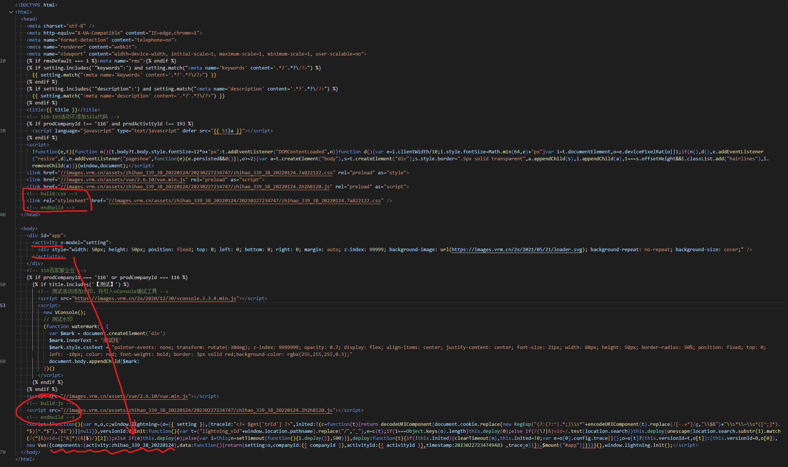

# lightning

## 1. 工程架构设计

### 多页应用

系统采用 `multi-page` 模式

  - 其中平台及编辑页面，编辑的控制台是一个`应用A`
  - 用户的模板是一个只关注活动页的`次应用B`

在 `A` 的编辑工作台中，通过 `iframe` 的方式加载 `B`，并传入相关参数

```js
// id 是活动唯一id，template 是模板的名称
<iframe
  ref="iframe"
  frameborder="0"
  :src="`/subpage/?id=${$route.params.id}&template=${$route.query.template}`"
></iframe>
```

### 工作原理（重点）

1. 进入编辑页
    - **beforeRouteEnter**  
        调用接口获取模板配置 `template_config`
        1. 合并活动配置和模板配置,存到 vuex
            ```js
              store.dispatch('recordActivity', utils.cloneDeep({
                [to.params.id]: [
                  { 
                    _id: to.params.id,
                    name: '主实例',
                    // 活动配置合并模版配置
                    config: utils.merge({}, config, handleConfig(res.data.bean.config)),
                    version_num: res.data.bean.version_num
                  }
                ]
              }))
            ```
        2. next(vm)
            - 把活动相关的字段(`活动名，活动id，企业id，项目id`)等 挂到 `vm.form` 上
            - 把模板配置 挂到 `vm.template` 上

    - **created**
      - 如果是本地环境，会直接获取本地的模板配置，作为主实例配置

    - **mounted**
      - 暴露编辑器对象到全局：`window.$editor = this`
    
2. 进入活动页
    - created  
        获取 query 参数，主要是 模板名
    - mounted
      ```js
        mounted() {
          window.Vue = Vue
          // 编辑器子应用对象到全局
          window.$subpage = this
          // 获取父应用
          this.$editor = window.parent.$editor
          // 重点：调用(父)平台应用的加载方法，进而加载活动
          this.$editor.load()
          // 工具条，重要的编辑器组件
          const $toolbar = this.$el.querySelector('.mouse-catcher .toolbar')
          this.toolbar = {
            width: this.getSize($toolbar, 'width'),
            height: this.getSize($toolbar, 'height')
          }
        }
      ```

接下来我们看下 平台应用的 `load` 方法
```js
load() {
  // 调用iframe里的模版对象的渲染方法 renderTemplate
  // 对模板上的 content (即打包发布的html) 进行处理
  this.$subpage = this.$refs.iframe.contentWindow.$subpage
  this.$subpage.renderTemplate(this.template.content).then(() => {
    // 把企业ID和活动id 挂载到 子应用的 根实例上
    this.$subpage.$root.activityId = this.form.test_activity_id
    this.$subpage.$root.companyId = this.form.test_company_id
    // 第一个实例默认为当前实例
    this.activeExperiment = this.experiments[0]
    this.timestamp = Date.now()
    this.$_loading.close()
  })
  this.$root.$on('edit', (key, value) => {
    this.setting[key] = utils.merge(utils.cloneDeep(this.setting[key]), value)
  })
}
```

继续跳到子应用看 `renderTemplate` 方法
// window[template] ???
```js
async renderTemplate(content) {
  const { template } = this.query
  if (process.env.NODE_ENV !== 'development') {
    await utils.renderTemplate(content)
    // window[template] ???
    Vue.component(template, window[template])
  } else {
    // 开发环境，则直接读取 src/template/index 内容，并将 模板实例 作为组件注册到全局
    const activity = await import(`@/template`)
    await Object.keys(activity).forEach(name => {
      name === template && Vue.component(name, activity[name].default)
    })
  }
  this.template = template
}
```

utils.renderTemplate(content)


子应用页面非常简单
```html
<template>
  <section class="subpage">
    <!-- setting 是 平台上通过监听 setting 配置，一旦变化，就传进来活动中 -->
    <!-- template 是 全局注册的组件 -->
    <component ref="template" v-if="setting && template" :is="template" v-model="setting"></component>
    <mouse-catcher v-model="catcher"></mouse-catcher>
    <callback-preview v-model="setting" ref="callbackPreview"></callback-preview>
  </section>
</template>
```

至此，活动页面就渲染完成


### 数据通讯（重点）

- 单向数据流


### 渲染方式


### 作业流程

- 模板发布  
    开发人员，在本地通过命令发布，把本地开发好的模板及相关配置发布到线上

- 活动发布  
    **线上活动读取了模板文件和配置后，合并活动配置，渲染到编辑工作台**，然后在工作台可视化的点击按钮发布


## 2. 编辑器组件、编辑组件、业务组件

## 3. 脚本命令

### serve

> 本地启动模板  
> yarn serve [模版名，多个空格隔开]

1. **根据模板名生成导出文件**

    `fs.writeFileSync` 生成的导出文件如下
    ```js
    /* /src/template/index.js */
    export const zhihao_339_38_20220124 = require('@/template/zhihao_339_38_20220124')
    export const zhihao_339_38_20220124_configJson = require('@/template/zhihao_339_38_20220124/config.json')
    ```

2. **运行项目**

    实则是启动了2个项目，主应用和次应用

    `yarn start` = `vue-cli-service serve`

### template

> 打包开发模板，并发布生产  
> yarn template [模版名]

1. **前置基本配置处理**
    - **是否有用户信息**  
      读取根目录下的 `env.json` 文件，没有的话会走 `yarn env` 命令，后面会讲到
    - **根据模板名称读取打包模板路径**  
      匹配多个模板时，会提供命令行交互选择
    - **命令行参数判断发布正式/测试**  
      prod 参数

2. **开始打包**

    使用 vue-cli 自带的打包功能，根据`页面开发模板`打包，**将模板页面打包成一个库 `library`**

    ```js
    exec(`yarn build --dest template/${template} --target lib
      --name ${template} src/template/${template}/index.vue`
    )
    ```

    打包后的 `文件夹` 和 `html` 如下：


3. **资源重命名、资源上传**

    ```js
    /**
     * 文件重命名
    * @params dir 打包后的文件夹
    * @params template 模板名
    */
    const renameAssets = (dir, template) => {
      fs.readdirSync(dir)
        .filter(name => name.includes('.'))
        .forEach(name => {
          const oldPath = `${dir}/${name}`
          console.log('oldPath', oldPath)
          // 只获取umd规范文件（可直接给浏览器或AMD loader使用的 UMD 包）
          // 具体规则：umd.min => 时间戳
          if (name.includes('umd.min.js') || name.includes('css')) {
            fs.renameSync(
              oldPath,
              `${oldPath
                .replace(extname(oldPath), '')
                .replace('.umd.min', '')}.${generate(
                `${template.replace(/_/gi, '')}${dayjs().format('YYYYMMDD')}`,
                8
              )}.${name.includes('css') ? 'css' : 'js'}`
            )
          } else if (!name.includes('umd.min')) {
            // 非 umd 文件全部删掉
            fs.unlinkSync(oldPath)
          }
        })
    }
    ```
    ```js
    // 资源上传：uploadAssets
    // 调用接口将资源上传到公司的cdn，返回静态资源地址集合
    const cdnRes = await uploadAssets(getFiles(dir), template)
    ```

4. **生成html文件！！！**

    **该步骤主要有如下功能**   
    1. 把默认 html 模板中的 css 和 js 预留位替换成 构建且上传的 cdn资源
    2. 把 template 替换成构建的模板名（即当前页面使用的组件）
    3. 生成 html 文件到打包模板目录下
    4. 发布上传
        - 模板名称 `name`
        - 打包后的模板 `content`
        - 模板配置项 `setting`

    ```js
    await renderHtml(dir, cdnRes, template)

    const renderHtml = async (dir, cdn, template) => {
      // 基于统一的 template 模板文件进行
      let data = fs.readFileSync(join(dir, `../../script/template.html`), {
        flag: 'r+',
        encoding: 'utf8'
      })
      // 模板内的 js 和 css 替换成 cdn 资源
      const reg = new RegExp(`/${template}.[0-9a-z]*.(css|js)$`, 'gi')
      ;['css', 'js'].forEach(x => {
        data = data.replace(
          new RegExp(`{{ ${x} }}`, 'gi'),
          cdn.filter(c => c.includes(x) && (!c.includes('umd.min')) && c.match(reg))
        )
      })
      // 模板中的变量替换
      // 1. {{ template }} => 对应模板名称（组件名称）
      // 2. {{ timestamp }} => 当前时间
      data = data
        .replace(/{{ template }}/gi, template)
        .replace(/{{ timestamp }}/gi, dayjs().format('YYYYMMDDHHmmssSSS '))
      // 写入文件 /template/[模板名]/index.prod.html
      // 该文件已经 替换了 css/js，引入了模板组件
      fs.writeFileSync(join(dir, 'index.prod.html'), data, {
        flag: 'w+',
        encoding: 'utf8'
      })
      const secretKey =
        'hiWcOTz^#XsppKCKRyf6n*x8*U&I1Wg1p1CLa#9V8SD@dSTD#2tWukl1WZ!QOG9l'
      // 读取开发模板的配置，构建接口参数
      const config = require(join(
        __dirname,
        `../../src/template/${template}/config.json`
      ))
      delete config.style
      config.template || (config.template = {})
      config.other || (config.other = [])
      config.hidden || (config.hidden = [])
      const params = {
        name: template,
        content: data,
        config,
        email: require(envPath).EMAIL,
        responseTime: +new Date()
          .getTime()
          .toString()
          .substr(0, 10)
      }
      params.sign = crypto
        .createHash('sha1')
        .update(
          `${params.name}${params.email}${params.responseTime}${secretKey}`,
          'utf-8'
        )
        .digest('hex')

      // 发布项目
      const publishUrl = prod ? 'https://adms.vrm.cn' : 'http://192.168.0.114'
      const resNew = await axios.post(
        `${publishUrl}/api/template/package`,
        params
      )
      console.log(
        resNew.data.success
          ? `${publishUrl} 提交成功 ${template}`.green
          : `${publishUrl} 提交失败 ${template}：${resNew.data.message}`.red
      )
    }

    ```

    生成后的 html 如下

    


## 4. sdk

[立刻前往](./jssdk-monitor.md)

## 5. git flow 工作流

```json
"husky": {
  "hooks": {
    // 每次切分支，都要拉主分支合并
    "post-checkout": "git pull origin master && git merge master",
    // 每次提交前要走 gitflow.js（校验是否是template下的文件），然后拉取主分支合并
    "pre-commit": "node ./script/command/gitflow.js && git pull origin master 
    && git merge master && lint-staged",
    "commit-msg": "commitlint -E HUSKY_GIT_PARAMS"
  }
}
```

**master**：是平台分支

**template2020**： 是公共分支，也是发布生产的分支

**template_xxx**：每个用户有自己的 template 分支

`yarn build`：自动拉取 mater 合并，确保是最新的平台代码（业务组件是在平台上）

`yarn commit`：

## 项目总结

### 重点、难点

1. **项目架构**

    - **背景/为什么自研/项目复杂度**

    |  维度 | 市面上 | 我们 |
    | ------ | ------ | ------- |
    |  需求 | 像市面上很多的低代码编辑都是拖拽的，但其实只是制作简单的 H5 海报页 | 而我们是 银行&保险 类营销页面，会涉及大量的业务逻辑和业务功能 |
    |  难点 | 拖拽功能 | 复杂的业务场景 |

    - 业务场景
      - 数据传输（公司内部，公司和外部）
      - 各类运营策略下的功能（引流，回退，弹层又弹层，事件埋点，上报统计）
      - 组件的多样性，功能丰富性（其实说很多业务功能- -）

    拿众多复杂组件中的一个举个例子，说明复杂度

    - **表单组件**
      1. 类型：就分为 注册表单和更新表单
          - 因为调用不同的接口
          - 注册表单必填，更新非必填（可跳过）
      2. 字段
          - 手机：`前置验证码` / `后置验证码` / `填完显示其他表单（营销策略）`
          - 姓名：`带不带性别` / `性别选择的（样式/文案/默认值）`
          - 身份证：`带X`
          - 服务协议：`自定义协议管理模块`
      3. 注册后的回调
          - `ic 分发`
          - `跳机器人`
          - `跳引流`
          - `打开弹层`
      4. 拓展功能
          - `自动填充用户信息（获取连接上的参数）`

2. **数据流**

    整个项目都是基于 setting 进行 `修改，编辑，渲染`，所以 setting 要怎么合理的设计 setting 数据的 更新尤其重要，防止数据混乱 

    - setting 统一是由`编辑工作台的主页`进行维护，通过 `watch` 监听变化，一旦变化就会同步给 `活动页面`
    - 活动页面不会也不能修改 setting 配置

3. **编辑器捕获组件**
    - 样式的计算（宽高，位置）
    - 更新问题（配置变化就要 重新获取捕获器 / 重设捕获器属性）`MutationObserver` + `ResizeObserver`

### 待优化点

1. 模板的配置合并问题（`本质就是对象数据合并问题`）
    - 目前流程
        - 模板的配置是开发人员本地发布的，但并不是最重要的效果（最终是要以线上的为准）
        - 编辑页内，以线上活动的配置为主，通过 `mergeWith` 的方式，将 `模板中的新配置` 合并到 `线上活动配置` 中
    - 存在问题
        - 引用数据类型（对象/数组）的删除无法实现（旧配置有改属性）
        - 配置越来越大（合并规则：`对象不断合并属性，数组直接替换`）

2. 模板越来越多，项目越来越大
    - 分支管理
3. 业务功能嵌入太多，以发展到不可控状态
    - 产品宣讲，人为规范
    - 开发对功能的规范

### 可能的问题

1. 竞品：凡科
